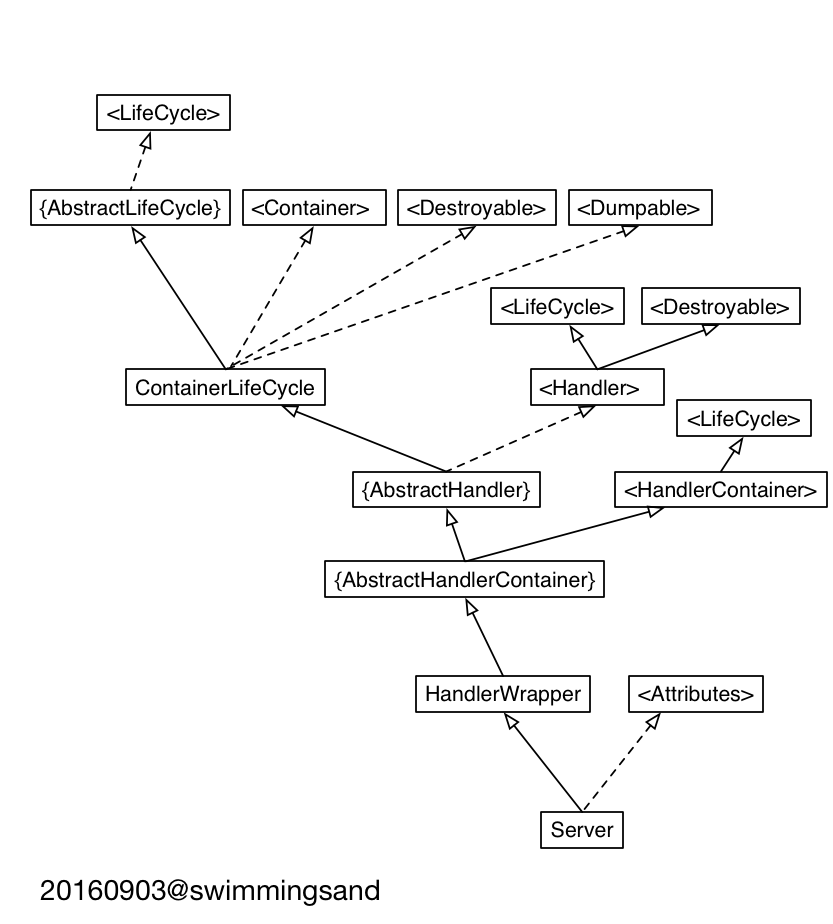

# Server架构分析

## org.eclipse.jetty.server.Server静态结构图

这个类在jetty-server-9.3.9.v20160517.jar这个包里

Server

### HandlerWrapper

HandlerWrapper是一个HandlerContainer，但是只容纳一个handler。

### Attributes

### AbstractHandlerContainer

### AbstractHandler

AbstractHandler实现了Handler的一些基础方法，设置和获取Server实例的方法，没有实现处理请求的handle方法。

### HandlerContainer

Handler处理器容器接口，可以持有一个或多个handler。

### ContainerLifeCycle

ContainerLifeCycle是一个管理beans的容器，实现了自身的doStart方法启动容器的生命，实现了doStop方法终止容器的生命。

### Handler

### LifeCycle

### AbstractLifeCycle

AbstractLifeCycle是LifeCycle的一个模板实现（设计模式里的模板方法模式），留有两个方法doStart、doStop供具有LifeCycle行为的具体类去实现。

### Container

### Destroyable

### Dumpable

## Server的组合结构

Connector

ServerSocketChannel

Acceptor

Acceptor是Connector的内部类，可以访问Connector的内部成员变量和函数。

Executor

ThreadPool

QueuedThreadPool

AbstractLifeCycle

SizedThreadPool

Dumpable

ExecutorThreadPool

## Handler

ServletContextHandler

具体类

ContextHandler

具体类

ScopedHandler

抽象类

HandlerWrapper

具体类

Graceful

优雅关闭

_outerScope

_nextScope

HandlerCollection

AbstractHandlerContainer

RequestLogHandler

ServletHandler

SessionHandler

SecurityHandler

GzipHandler

ServletHolder

Servlet

handle

at org.eclipse.jetty.server.Server.handle(Server.java:507)
at org.eclipse.jetty.server.HttpChannel.handle(HttpChannel.java:319)
at org.eclipse.jetty.server.HttpConnection.onFillable(HttpConnection.java:253)
at org.eclipse.jetty.io.AbstractConnection$ReadCallback.succeeded(AbstractConnection.java:273)
at org.eclipse.jetty.io.FillInterest.fillable(FillInterest.java:95)
at org.eclipse.jetty.io.SelectChannelEndPoint$2.run(SelectChannelEndPoint.java:93)
at org.eclipse.jetty.util.thread.QueuedThreadPool.runJob(QueuedThreadPool.java:671)
at org.eclipse.jetty.util.thread.QueuedThreadPool$2.run(QueuedThreadPool.java:589)
at java.lang.Thread.run(Thread.java:745)

调用    public final void handle(String target, Request baseRequest, HttpServletRequest request, HttpServletResponse response) throws IOException, ServletException;方法

发送response

at sun.nio.ch.SocketChannelImpl.write(SocketChannelImpl.java:491)
at org.eclipse.jetty.io.ChannelEndPoint.flush(ChannelEndPoint.java:177)
at org.eclipse.jetty.io.WriteFlusher.flush(WriteFlusher.java:419)
at org.eclipse.jetty.io.WriteFlusher.write(WriteFlusher.java:313)
at org.eclipse.jetty.io.AbstractEndPoint.write(AbstractEndPoint.java:141)
at org.eclipse.jetty.server.HttpConnection$SendCallback.process(HttpConnection.java:733)
at org.eclipse.jetty.util.IteratingCallback.processing(IteratingCallback.java:241)
at org.eclipse.jetty.util.IteratingCallback.iterate(IteratingCallback.java:224)
at org.eclipse.jetty.server.HttpConnection.send(HttpConnection.java:521)
at org.eclipse.jetty.server.HttpChannel.sendResponse(HttpChannel.java:692)
at org.eclipse.jetty.server.HttpChannel.write(HttpChannel.java:746)
at org.eclipse.jetty.server.HttpOutput.write(HttpOutput.java:179)
at org.eclipse.jetty.server.HttpOutput.write(HttpOutput.java:163)
at org.eclipse.jetty.server.HttpOutput.close(HttpOutput.java:213)
at org.eclipse.jetty.server.HttpWriter.close(HttpWriter.java:49)
at org.eclipse.jetty.server.ResponseWriter.close(ResponseWriter.java:163)
- locked <0x1321> (a org.eclipse.jetty.server.Utf8HttpWriter)
at org.eclipse.jetty.server.Response.closeOutput(Response.java:981)
at org.eclipse.jetty.server.HttpChannel.handle(HttpChannel.java:447)
at org.eclipse.jetty.server.HttpConnection.onFillable(HttpConnection.java:253)
at org.eclipse.jetty.io.AbstractConnection$ReadCallback.succeeded(AbstractConnection.java:273)
at org.eclipse.jetty.io.FillInterest.fillable(FillInterest.java:95)
at org.eclipse.jetty.io.SelectChannelEndPoint$2.run(SelectChannelEndPoint.java:93)
at org.eclipse.jetty.util.thread.QueuedThreadPool.runJob(QueuedThreadPool.java:671)
at org.eclipse.jetty.util.thread.QueuedThreadPool$2.run(QueuedThreadPool.java:589)
at java.lang.Thread.run(Thread.java:745)

Server启动过程

doStart方法

Server是一个beans容器，管理着QueuedThreadPool（AUTO）、ServerConnector（AUTO）、HandlerCollection（MANAGED），先启动这些组件。

AUTO类型的bean，需要先调用manage方法将其设置成MANAGED，然后调用setStopTimeout设置停止生命周期的超时时间。

所有管理的bean，调用Server的start方法启动，但不启动ServerConnector，因为需要在最后启动，所以后面单独启动ServerConnector。

QueuedThreadPool的doStart，调用startThreads启动线程池的work线程，启动线程数量由_minThreads决定。

HandlerCollection是一个beans容器，管理ServletContextHandler（AUTO）和RequestLogHandler（AUTO）。

ServletContextHandler是一个beans容器，管理ServletHandler（MANAGED）

ServletHandler管理具体的Servlet。ServletHandler内部有一个_servletNameMap，key为Servlet的名称，默认为Servlet类的全限定名，value为Servlet的实例对象。有一个PathMap<ServletHolder>类型的_servletPathMap，key为URL相对路径，value为ServletMapping。

ServletHandler是一个beans容器，管理ServletHolder（HelloServlet）（AUTO）、ServletMapping（HelloServlet）（POJO）、ServletHolder（Default404Servlet）（AUTO）、ServletMapping（Default404Servlet）（POJO）。ServletHandler不负责Holder的启动。

ServletContextHandler的startContext方法调用ServletHandler的initialize方法。

启动ServerConnector，调用其start方法，最终调用doStart方法，doStart方法先调用继承的父类AbstractNetworkConnector的doStart方法，AbstractNetworkConnector的doStart方法调用ServerConnector的open方法，打开一个服务器端socket用来接收请求。AbstractNetworkConnector的doStart方法打开服务器端socket后继续调用父类AbstractConnector的doStart方法，

ServerConnector也是一个具有管理beans的容器ContainerLifeCycle，管理者Server、QueuedThreadPooll、ScheduledExecutorScheduler、ArrayByteBufferPool、HttpConnectionFactory、ServerConnectorManager、ServerSocketChannelImpl这些bean，负责启动和停止它们的生命。

ServerConnectorManager是一个管理beans的容器，管理ManagedSelector，默认创建CPU核心数一半的ManagedSelector，负责启动ManagedSelector，调用ManagedSelector的doStart方法启动它的生命周期，ManagedSelector的doStart方法会先创建一个Selector，然后ManagedSelector传给ServerConnectorManager，ServerConnectorManager将其放入线程池的队列，让线程池的worker线程运行ManagedSelector的run方法。

ServerConnector启动完Server、QueuedThreadPooll、ScheduledExecutorScheduler、ArrayByteBufferPool、HttpConnectionFactory、ServerConnectorManager、ServerSocketChannelImpl这些bean之后就创建Acceptor，默认创建一个Acceptor，添加到自身的bean管理容器，然后放入线程池的队列，让线程池的worker线程运行ManagedSelector的run方法。

org.eclipse.jetty.server.Server@34c4973 - STARTING
 += qtp1685232414{STARTED,1<=4<=4,i=1,q=0} - STARTED
 |   +- 16 qtp1685232414-16 RUNNABLE @ sun.nio.ch.KQueueArrayWrapper.kevent0(Native Method)
 |   +- 17 qtp1685232414-17-acceptor-0@2bbaf4f0-ServerConnector@77f99a05{HTTP/1.1,[http/1.1]}{0.0.0.0:8080} RUNNABLE @ java.lang.ClassLoader$NativeLibrary.find(Native Method) prio=3
 |   +- 13 qtp1685232414-13 RUNNABLE @ sun.nio.ch.KQueueArrayWrapper.kevent0(Native Method)
 |   +- 18 qtp1685232414-18 TIMED_WAITING @ sun.misc.Unsafe.park(Native Method) IDLE
 += ServerConnector@77f99a05{HTTP/1.1,[http/1.1]}{0.0.0.0:8080} - STARTED
 |   +~ org.eclipse.jetty.server.Server@34c4973 - STARTING
 |   +~ qtp1685232414{STARTED,1<=4<=4,i=1,q=0} - STARTED
 |   += org.eclipse.jetty.util.thread.ScheduledExecutorScheduler@46daef40 - STARTED
 |   +- org.eclipse.jetty.io.ArrayByteBufferPool@63440df3
 |   += HttpConnectionFactory@5f3a4b84[HTTP/1.1] - STARTED
 |   |   +- HttpConfiguration@27f723{32768/8192,8192/8192,https://:0,[]}
 |   += org.eclipse.jetty.server.ServerConnector$ServerConnectorManager@612679d6 - STARTED
 |   |   += org.eclipse.jetty.io.ManagedSelector@12028586 id=0 keys=0 selected=0 id=0
 |   |   |   +- sun.nio.ch.KQueueSelectorImpl@62a5c3e0 keys=0
 |   |   += org.eclipse.jetty.io.ManagedSelector@17776a8 id=1 keys=0 selected=0 id=1
 |   |       +- sun.nio.ch.KQueueSelectorImpl@581762da keys=0
 |   +- sun.nio.ch.ServerSocketChannelImpl[/0:0:0:0:0:0:0:0:8080]
 |   +- qtp1685232414-17-acceptor-0@2bbaf4f0-ServerConnector@77f99a05{HTTP/1.1,[http/1.1]}{0.0.0.0:8080}
 += org.eclipse.jetty.server.handler.HandlerCollection@35a50a4c[o.e.j.s.ServletContextHandler@646007f4{/,null,AVAILABLE}, org.eclipse.jetty.server.handler.RequestLogHandler@68ceda24] - STARTED
 |   += o.e.j.s.ServletContextHandler@646007f4{/,null,AVAILABLE} - STARTED
 |   |   += org.eclipse.jetty.servlet.ServletHandler@481a15ff - STARTED
 |   |   |   += com.anjuke.search.http.servlet.HelloServlet-31f924f5@fcb88444==com.anjuke.search.http.servlet.HelloServlet,-1,false - STARTED
 |   |   |   +- [/hello]=>com.anjuke.search.http.servlet.HelloServlet-31f924f5
 |   |   |   += org.eclipse.jetty.servlet.ServletHandler$Default404Servlet-6c9f5c0d@22ac5510==org.eclipse.jetty.servlet.ServletHandler$Default404Servlet,-1,false - STARTED
 |   |   |   +- [/]=>org.eclipse.jetty.servlet.ServletHandler$Default404Servlet-6c9f5c0d
 |   |   |
 |   |   +> No ClassLoader
 |   |   +> Handler attributes o.e.j.s.ServletContextHandler@646007f4{/,null,AVAILABLE}
 |   |   |   +- org.eclipse.jetty.server.Executor=qtp1685232414{STARTED,1<=4<=4,i=1,q=0}
 |   |   +> Context attributes o.e.j.s.ServletContextHandler@646007f4{/,null,AVAILABLE}
 |   |   |   +- org.eclipse.jetty.util.DecoratedObjectFactory=org.eclipse.jetty.util.DecoratedObjectFactory[decorators=1]
 |   |   +> Initparams o.e.j.s.ServletContextHandler@646007f4{/,null,AVAILABLE}
 |   += org.eclipse.jetty.server.handler.RequestLogHandler@68ceda24 - STARTED
 |       += org.eclipse.jetty.server.NCSARequestLog@281e3708 - STARTED
 |
 +> sun.misc.Launcher$AppClassLoader@4517d9a3
     +- file:/Library/Java/JavaVirtualMachines/jdk1.8.0_60.jdk/Contents/Home/lib/ant-javafx.jar
     +- file:/Library/Java/JavaVirtualMachines/jdk1.8.0_60.jdk/Contents/Home/lib/dt.jar
     +- file:/Library/Java/JavaVirtualMachines/jdk1.8.0_60.jdk/Contents/Home/lib/javafx-mx.jar
     +- file:/Library/Java/JavaVirtualMachines/jdk1.8.0_60.jdk/Contents/Home/lib/jconsole.jar
     +- file:/Library/Java/JavaVirtualMachines/jdk1.8.0_60.jdk/Contents/Home/lib/packager.jar
     +- file:/Library/Java/JavaVirtualMachines/jdk1.8.0_60.jdk/Contents/Home/lib/sa-jdi.jar
     +- file:/Library/Java/JavaVirtualMachines/jdk1.8.0_60.jdk/Contents/Home/lib/tools.jar
     +- file:/Library/Java/JavaVirtualMachines/jdk1.8.0_60.jdk/Contents/Home/jre/lib/charsets.jar
     +- file:/Library/Java/JavaVirtualMachines/jdk1.8.0_60.jdk/Contents/Home/jre/lib/deploy.jar
     +- file:/Library/Java/JavaVirtualMachines/jdk1.8.0_60.jdk/Contents/Home/jre/lib/javaws.jar
     +- file:/Library/Java/JavaVirtualMachines/jdk1.8.0_60.jdk/Contents/Home/jre/lib/jce.jar
     +- file:/Library/Java/JavaVirtualMachines/jdk1.8.0_60.jdk/Contents/Home/jre/lib/jfr.jar
     +- file:/Library/Java/JavaVirtualMachines/jdk1.8.0_60.jdk/Contents/Home/jre/lib/jfxswt.jar
     +- file:/Library/Java/JavaVirtualMachines/jdk1.8.0_60.jdk/Contents/Home/jre/lib/jsse.jar
     +- file:/Library/Java/JavaVirtualMachines/jdk1.8.0_60.jdk/Contents/Home/jre/lib/management-agent.jar
     +- file:/Library/Java/JavaVirtualMachines/jdk1.8.0_60.jdk/Contents/Home/jre/lib/plugin.jar
     +- file:/Library/Java/JavaVirtualMachines/jdk1.8.0_60.jdk/Contents/Home/jre/lib/resources.jar
     +- file:/Library/Java/JavaVirtualMachines/jdk1.8.0_60.jdk/Contents/Home/jre/lib/rt.jar
     +- file:/Library/Java/JavaVirtualMachines/jdk1.8.0_60.jdk/Contents/Home/jre/lib/ext/cldrdata.jar
     +- file:/Library/Java/JavaVirtualMachines/jdk1.8.0_60.jdk/Contents/Home/jre/lib/ext/dnsns.jar
     +- file:/Library/Java/JavaVirtualMachines/jdk1.8.0_60.jdk/Contents/Home/jre/lib/ext/jaccess.jar
     +- file:/Library/Java/JavaVirtualMachines/jdk1.8.0_60.jdk/Contents/Home/jre/lib/ext/jfxrt.jar
     +- file:/Library/Java/JavaVirtualMachines/jdk1.8.0_60.jdk/Contents/Home/jre/lib/ext/localedata.jar
     +- file:/Library/Java/JavaVirtualMachines/jdk1.8.0_60.jdk/Contents/Home/jre/lib/ext/nashorn.jar
     +- file:/Library/Java/JavaVirtualMachines/jdk1.8.0_60.jdk/Contents/Home/jre/lib/ext/sunec.jar
     +- file:/Library/Java/JavaVirtualMachines/jdk1.8.0_60.jdk/Contents/Home/jre/lib/ext/sunjce_provider.jar
     +- file:/Library/Java/JavaVirtualMachines/jdk1.8.0_60.jdk/Contents/Home/jre/lib/ext/sunpkcs11.jar
     +- file:/Library/Java/JavaVirtualMachines/jdk1.8.0_60.jdk/Contents/Home/jre/lib/ext/zipfs.jar
     +- file:/Users/zlq/Projects/work/uesearch/slow-http-api/target/classes/
     +- file:/Users/zlq/.m2/repository/org/apache/logging/log4j/log4j-api/2.4/log4j-api-2.4.jar
     +- file:/Users/zlq/.m2/repository/org/apache/logging/log4j/log4j-core/2.4/log4j-core-2.4.jar
     +- file:/Users/zlq/.m2/repository/org/apache/logging/log4j/log4j-slf4j-impl/2.4/log4j-slf4j-impl-2.4.jar
     +- file:/Users/zlq/.m2/repository/org/slf4j/slf4j-api/1.7.12/slf4j-api-1.7.12.jar
     +- file:/Users/zlq/.m2/repository/org/eclipse/jetty/jetty-server/9.3.9.v20160517/jetty-server-9.3.9.v20160517.jar
     +- file:/Users/zlq/.m2/repository/javax/servlet/javax.servlet-api/3.1.0/javax.servlet-api-3.1.0.jar
     +- file:/Users/zlq/.m2/repository/org/eclipse/jetty/jetty-http/9.3.9.v20160517/jetty-http-9.3.9.v20160517.jar
     +- file:/Users/zlq/.m2/repository/org/eclipse/jetty/jetty-io/9.3.9.v20160517/jetty-io-9.3.9.v20160517.jar
     +- file:/Users/zlq/.m2/repository/org/eclipse/jetty/jetty-servlet/9.3.9.v20160517/jetty-servlet-9.3.9.v20160517.jar
     +- file:/Users/zlq/.m2/repository/org/eclipse/jetty/jetty-security/9.3.9.v20160517/jetty-security-9.3.9.v20160517.jar
     +- file:/Users/zlq/.m2/repository/org/eclipse/jetty/jetty-servlets/9.3.9.v20160517/jetty-servlets-9.3.9.v20160517.jar
     +- file:/Users/zlq/.m2/repository/org/eclipse/jetty/jetty-continuation/9.3.9.v20160517/jetty-continuation-9.3.9.v20160517.jar
     +- file:/Users/zlq/.m2/repository/org/eclipse/jetty/jetty-util/9.3.9.v20160517/jetty-util-9.3.9.v20160517.jar
     +- file:/Applications/IntelliJ%20IDEA%20CE.app/Contents/lib/idea_rt.jar
     +- sun.misc.Launcher$ExtClassLoader@133314b

ServerConnector

ServerConnector --> {AbstractNetworkConnector}

{AbstractNetworkConnector} --> {AbstractConnector}

{AbstractNetworkConnector} --> <NetworkConnector>

{AbstractConnector} --> {ContainerLifeCycle}

{AbstractConnector} --> <Connector>

<Connector> --> <LifeCycle>

<Connector> --> <Graceful>

{AbstractConnector} --> <Dumpable>

<NetworkConnector> --> <Connector>

<NetworkConnector> --> <Closeable>

<Closeable> --> <AutoCloseable>

